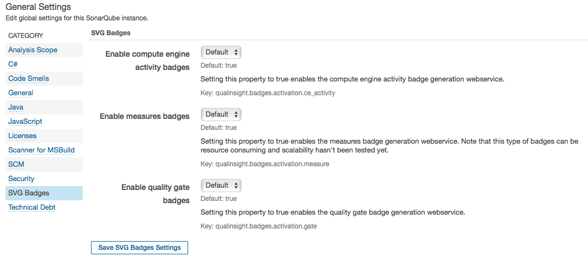

# SVG Badges plugin for SonarQube
Plugin for SonarQube that generates badges (SVG images) displaying information about projects' or views' quality. Two types of badges are currently available: `quality gate` badges and `measure` badges. You can see a running example of a `quality gate` badge on the line below.

 [](http://nemo.sonarqube.org/dashboard/index/com.qualinsight.plugins.sonarqube:qualinsight-plugins-sonarqube-badges) [](http://www.javadoc.io/doc/com.qualinsight.plugins.sonarqube/qualinsight-plugins-sonarqube-badges)

## Installation 

In order to use this plugin on your SonarQube server instance, you need first to install it. The plugin is available in SonarQube's update center under the name "SVG Badges". 

## Configuration

By default, the plugin is configured as follows: 

* quality gate badges webservice is activated 
* measures badges webservice is deactivated 

You can modify this configuration on SonarQube's administration page ("SVG Badges" section.)



*Note 1*: Measures badge webservice is currently deactivated due to lack of evaluation of the impact of its execution on both performance and resources consumption. I need to run some load tests in order to make sure that this web service scales nicely. Until then, please use this option carefully and do not hesitate to create an issue in GitHub if you detect a problem or if you want to help me in this task. 

## Usage

### Quality Gate status badge

Use the ``/api/badges/gate?key=<project or view key>`` URL in order to generate a badge that displays the quality gate status of a project or view. Depending on the project's status and SonarQube configuration, one of the following image types will be generated :

* [Passing](images/passing.svg) indicates that the project passes the quality gate (QG)
* [Warning](images/warning.svg) indicates that the project does not pass the quality gate due to QG warnings
* [Failing](images/failing.svg) indicates that the project does not pass the quality gate due to QG errors
* [No Gate](images/no_gate.svg) indicates that no quality gate has been set for the specified project
* [Not Found](images/not_found.svg) indicates that the project / view could not be found

By default, the plugin generates badges with rounded corners. If you want to generate flat badges instead, add the optional parameter ``template`` with value ``FLAT`` as follows: ``/api/badges/gate?key=<project or view key>&template=FLAT``.

#### Display the Quality Gate badge on a web page

You can display Quality Gate badges using HTML or Markdown as follows.

*Note 2*: The plugin is currently installed on SonarQube's Nemo public instance. If you want to display a badge for a project analyzed on Nemo, just use ``nemo.sonarqube.org`` as ``<serverBaseURL>``.

##### HTML Link:

```
<a href="<serverBaseURL>/dashboard/index/<project or view key>">/api/badges/gate?key=<project or view key>"/></a>
```

Example:

```
<a href="http://localhost:9000/dashboard/index/com.qualinsight.plugins.sonarqube:qualinsight-plugins-sonarqube-badges"></a>
```

##### Markdown Link:

```
[](<serverBaseURL>/dashboard/index/<project or view key>)
```

Example:

```
[](http://localhost:9000/dashboard/index/com.qualinsight.plugins.sonarqube:qualinsight-plugins-sonarqube-badges)
```

### Measure badge

Use the ``/api/badges/measure?key=<project or view key>&metric=<metric key>`` URL in order to generate a badge that displays any measure related to a project or view. 

As for quality gate status badges, the plugin generates by default badges with rounded corners. If you want to generate flat badges instead, add the optional parameter ``template`` with value ``FLAT`` as follows: ``/api/badges/measure?key=<project or view key>&metric=<metric key>&template=FLAT``.

SonarQube's [CoreMetrics class](https://github.com/SonarSource/sonarqube/blob/master/sonar-plugin-api/src/main/java/org/sonar/api/measures/CoreMetrics.java) file lists all `metric keys` that can be used. I have listed the ones you may need to display as a badge in the following table :

| Metric key | Description |
|------------|-------------|
| ncloc | # of lines of code (excluding comments and empty lines) |
| comment_lines_density | Percentage of comments |
| public_documented_api_density | Percentage of documented API |
| function_complexity | Complexity by function |
| tests_errors | # of tests that have stopped due to an error |
| tests_failures | # of tests whose assertions have failed |
| skipped_tests | # of ignored tests |
| test_success_density | %age of tests that have succeeded |
| coverage | UT coverage %age |
| new_coverage | UT coverage %age on new code |
| it_coverage | IT coverage %age |
| new_it_coverage | IT coverage %age on new code |
| overall_coverage | Overall coverage %age |
| new_overall_coverage | Overall coverage %age on new code |
| duplicated_lines_density | lines duplication %age |
| blocker_violations | # of blocker issues |
| critical_violations | # of new critical issues |
| new_blocker_violations | # of blocker issues |
| new_critical_violations | # of new critical issues |
| code_smells | # of code smells |
| new_code_smells | # of new code smells |
| bugs | # of bugs |
| new_bugs | # of new bugs |
| vulnerabilities | # of vulnerabilities |
| new_vulnerabilities | # of new vulnerabilities |
| sqale_debt_ratio | technical debt ratio |
| new_sqale_debt_ratio | new technical debt ratio |

*Note 3*: Some `metric keys` are not usable "as is" as they return values that need interpretation (such as time, effort or ratings.) This explains why I haven't added them to the table yet.

#### Display the Measure badge on a web page

As for Quality Gate badges, you can use HTML or markdown as follows:

##### HTML Link:

```
<a href="<serverBaseURL>/dashboard/index/<project or view key>">/api/badges/measure?key=<project or view key>&metric=<core metric key>"/></a>
```

Example:

```
<a href="http://localhost:9000/dashboard/index/com.qualinsight.plugins.sonarqube:qualinsight-plugins-sonarqube-badges"></a>
```

##### Markdown Link:

```
[](<serverBaseURL>/dashboard/index/<project or view key>)
```

Example:

```
[](http://localhost:9000/dashboard/index/com.qualinsight.plugins.sonarqube:qualinsight-plugins-sonarqube-badges)
```
### Webservices documentation

Webservices provided by the SVG Badges plugin are self-documented. Once installed, go to the webservice documentation page of your SonarQube instance and look at the documentation for ``/api/badges``.

## Known limitations

If the security option "force user authentication" is set on your SonarQube instance, then all webservices become unreachable unless the user is authenticated. As a result, badges cannot be retrieved if this option is set.

If you want more information about this limitation, have a look at issue [#15](https://github.com/QualInsight/qualinsight-plugins-sonarqube-badges/issues/15) and [SONAR-6948](https://jira.sonarsource.com/browse/SONAR-6948).)

Some metrics that return an array of data or data representing times or ratings cannot be correctly displayed as a measure badge for now. Maybe a future version of the plugin will handle such cases. Meantime, please stick to the list of supported metrics that is provided on this page.

## Contributing to the project

If you want to contribute to this project, please have a look at the [developer toolset page](https://github.com/QualInsight/qualinsight-developer-toolset). It provides contribution guidelines I ask you to follow. Thanks in advance for your help !

## Conclusion

New feature ideas and contributions are more than welcome. A [Google group](https://groups.google.com/forum/#!forum/svg-badges) named [SVG Badges](https://groups.google.com/forum/#!forum/svg-badges) has been created in order to facilitate discussions about this plugin. This project's quality can be followed on [Nemo](https://nemo.sonarqube.org/overview?id=com.qualinsight.plugins.sonarqube%3Aqualinsight-plugins-sonarqube-badges).


